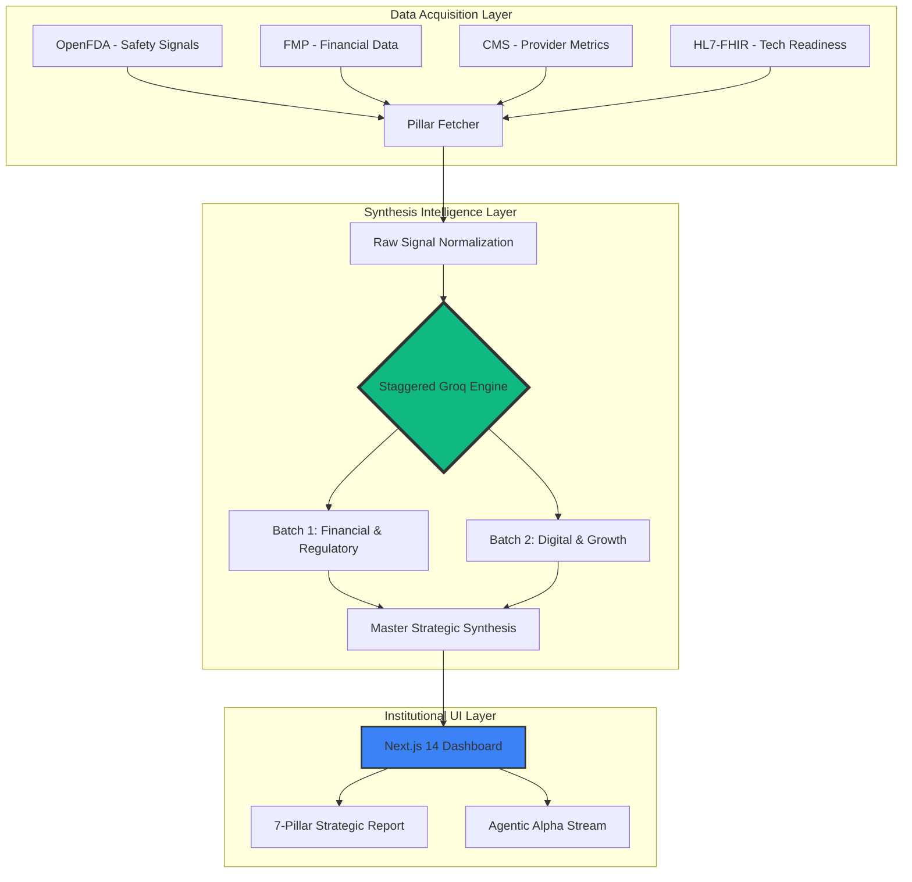

# ⚡ Vantage AI — Strategic Intelligence Engine

An enterprise-grade, AI-powered platform for generating real-time strategic consultancy reports, analyzing competitive landscapes, and surfacing predictive financial models across multiple industries.

## 🚀 Overview
Vantage AI transforms raw API signals from institutional sources (OpenFDA, FMP, CMS, HL7-FHIR) into board-ready strategic intelligence. Using a **Staggered Multi-Pillar Synthesis** architecture, the platform generates 7-dimensional strategic audits that bridge the gap between technical data and executive decision-making.

## 📊 System Working & Flowchart

The system operates on an asynchronous "Fetch-and-Synthesize" pipeline. Data is retrieved in parallel, then passed through a staggered LLM synthesis stage to ensure high-density metrics without rate-limiting friction.



## 🧠 The 7-Pillar Strategic Framework
Every intelligence audit is structured around seven institutional dimensions:
1.  **Financial Advisory**: EBITDA optimization, capital reallocation, and margin acceleration.
2.  **Regulatory Compliance**: Safety signal variance, HIPAA/FDA audit trails, and risk governance.
3.  **Digital Transformation**: HL7-FHIR interoperability, EHR integration latency, and agentic automation.
4.  **Strategic Growth**: M&A velocity, market-entry CAGR, and competitive consolidation.
5.  **Operational Efficiency**: Labor-to-output ratios, ALOS optimization, and triage latency.
6.  **Gap Analysis**: Delta identification between current talent/infra and institutional targets.
7.  **Evolutionary Roadmap**: Tactical (P1), Strategic (P2), and Global (P3) optimization milestones.

## 🛠️ Tech Stack

### High-Performance Frontend
- **Framework**: Next.js 14 (App Router)
- **Styling**: Tailwind CSS with custom Glassmorphism tokens.
- **Animations**: Framer Motion for micro-interactions and data-stream visualizations.
- **Icons**: Lucide React.

### Scalable Backend
- **Framework**: FastAPI (Asynchronous Orchestration)
- **Engine**: Groq (Llama-3.3-70B-Versatile) for sub-second intelligence synthesis.
- **Data Protocols**: HL7-FHIR, RESTful Institutional APIs.
- **Orchestration**: Staggered `asyncio` Task Groups.

## 🏁 Getting Started

### Prerequisites
- Node.js (v18+)
- Python (3.10+)
- Groq API Key
- OpenFDA & FMP API Keys

### Installation
1. **Clone & Install Backend**:
   ```bash
   cd backend
   python -m venv venv
   source venv/bin/activate
   pip install -r requirements.txt
   uvicorn main:app --reload
   ```

2. **Clone & Install Frontend**:
   ```bash
   cd frontend
   npm install
   npm run dev
   ```

---
*Created with Alpha Integrity · Built for the Future of Strategy*
